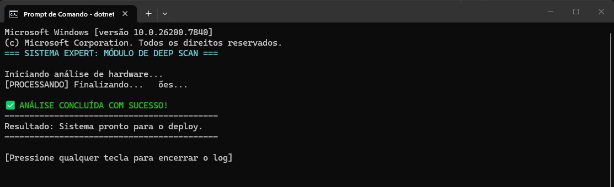

# 🔎 Projeto ScannerExpert

Este projeto é uma aplicação de console em **C# utilizando .NET** que simula uma **varredura de sistema (Deep Scan)**.

O objetivo da atividade foi aplicar a **1ª Heurística de Nielsen: Visibilidade do Status do Sistema**, mostrando ao usuário o progresso das operações enquanto o programa executa tarefas.

---

## 🛠️ Comandos Utilizados

- `dotnet new console`  
  Cria a estrutura inicial de um projeto de console em C#.

- `dotnet build`  
  Compila o projeto.

- `dotnet run`  
  Executa o programa no terminal.

---

## 📦 Estrutura do Projeto

Arquivos principais do projeto:

1. `Program.cs`  
   Contém o código responsável pela simulação da análise do sistema.

2. `ScannerExpert.csproj`  
   Arquivo de configuração do projeto.

Framework utilizado:

- `.NET 10.0 (net10.0)`

---

## ⚙️ Funcionamento do Programa

O programa simula uma **análise de sistema em várias etapas**, exibindo mensagens no terminal para informar o usuário sobre o progresso.

Durante a execução, o sistema mostra mensagens como:

[PROCESSANDO] Verificando CPU...
[PROCESSANDO] Lendo Memória RAM...
[PROCESSANDO] Sincronizando SDK...
[PROCESSANDO] Validando Permissões...
[PROCESSANDO] Finalizando...

Entre cada etapa, o programa utiliza:

Thread.Sleep(1500)

para simular o tempo de processamento.

Ao final, o sistema exibe a mensagem de conclusão da análise.

---

## 🧠 Heurística de UX Aplicada

**1ª Heurística de Nielsen — Visibilidade do Status do Sistema**

O sistema informa continuamente ao usuário o que está acontecendo durante a execução do processo.

Isso evita que o usuário pense que o programa **travou ou parou de funcionar**, melhorando a experiência de uso.

---

## 📸 Evidência de Execução

Print do terminal durante o processo de varredura, mostrando a mensagem `[PROCESSANDO]`.

Reflexão sobre: "Se o programa demorasse 10 segundos para finalizar, mas ficasse com a tela totalmente parada (em branco), sem as mensagens de '[PROCESSANDO]', o que o usuário provavelmente pensaria? Como a visibilidade de status melhora a Experiência do Usuário (UX)?"

Se o programa demorasse mais de 10 segundos para finalizar e a tela ficasse totalmente parada, o usuário provavelmente pensaria que o sistema travou, e talvez até reiniciaria o processo do zero.

Ao mostrar mensagens como [PROCESSANDO], o programa informa que a operação ainda está em andamento. Isso diminuí a incerteza do usuário e melhora a Experiência do Usuário (UX), pois ele entende que o sistema está trabalhando e não precisa interromper o processo.

